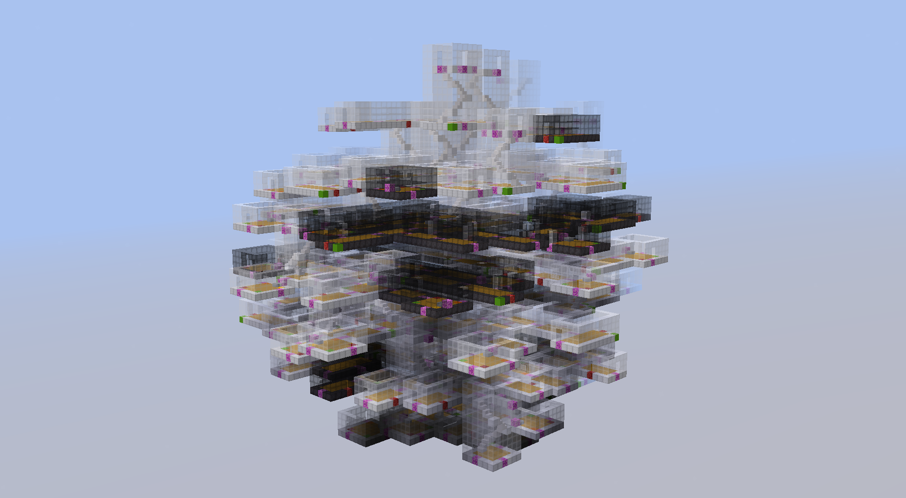

# Minecraft Dungeon Dev
<!-- ALL-CONTRIBUTORS-BADGE:START - Do not remove or modify this section -->

<!-- ALL-CONTRIBUTORS-BADGE:END -->

## How it Works 💡
<!-- prettier-ignore-start -->
<!-- markdownlint-disable -->

This repo provides a datapack capable of building dungeons in a tree-like fashion with various settings and various structure pools.

Terms:
- "root"  -> starting structure
- "room"  -> a structure placed in the dungeon
- "door"  -> a pathway to travel between structures in the dungeon, can face in 4 cardinal directions.
- "depth" -> how many structures from the starting place you are at

It starts by placing a "root" structure with "doors." All doors that are within a specific range of a player are processed: First a random room is chosen from a pool, then a door for that room is chosen. The room gets rotated such that the door faces the door of the previous room and gets randomly mirrored. This determines the required space for the new room. If the space is free, the room is placed. Otherwise the process is repeated until a room is placed or the maximum number of tries is reached, which results in a deadend.

This logic results in something like a tree.
<!-- markdownlint-enable -->
<!-- prettier-ignore-end -->

## How to Use 📝
<!-- prettier-ignore-start -->
<!-- markdownlint-disable -->

Go to the [release page](https://github.com/IceFreez3r/MC-DungeonDev/releases/latest) and either download the demo world or only the datapack for use in your own world.

To then see how the datapack works, open the world and run `/function dg:build/_demo` to see how it generates. You can also run `/function dg:build/_demo_last` to rebuild the same dungeon.

The world has two demo levels that are randomly chosen. The first level has a yellow floor, the second a green. Both levels have two sublevels in white and black. The sublevels have different probabilities of appearing in the two levels, but you will see that yourself.
<!-- markdownlint-enable -->
<!-- prettier-ignore-end -->

## Settings ⚙️

To change the general settings how the dungeon is generated, see [this function](./data/dg/functions/first_init.mcfunction). You can modify them with `/scoreboard players set .<setting> dg.options <value>`.

## Adding your own level
<!-- prettier-ignore-start -->
<!-- markdownlint-disable -->

To add your own level, follow these steps. You can skip this if you just want to add rooms to the existing levels.
1. Create a new folder in [dg:dungeons/](./data/dg/functions/dungeons/) with the name of your level.
1. In the folder create a new empty names.mcfunction file and deadend.mcfunction file (if you want to handle deadends).
1. In [dg:dungeons/place.mcfunction](./data/dg/functions/dungeons/place.mcfunction#L5) add a new line that calls your levels names.mcfunction file.
1. In [dg:dungeons/root.mcfuntion](./data/dg/functions/dungeons/root.mcfunction#L3) add a new line. Change the name of the marker to the one that is associated with your root.
1. Add a new line in [dg:dungeons/deadend.mcfunction](./data/dg/functions/dungeons/deadend.mcfunction) if you want to handle deadends.
1. Ingame run `/scoreboard players add .levels dg.options 1` to let the datapack know that you added a new level.

After you added some rooms to your level (see [Adding your own room](#adding-your-own-room)), you can run `/scoreboard players set .level dg.options <your level number>` to force the level in every run, which makes it easier to test and debug.

To have multiple sublevels in your level, you first need to [create a room](#adding-your-own-room) for that level. In the chat menu of that room click "Modify Sublevel transition weights". You will by default see a 1x1 matrix. Set the desired number of sublevels with the buttons in the header. Then modify the weights in the matrix. Here are some examples:

|  | 1 | 2 |
| - | - | - |
| <b>1</b> | 19 | 1 |
| <b>2</b> | 1 | 19 |

This will switch the sublevel on average every 20 rooms. So long stretches of the same sublevel.

|  | 1 | 2 |
| - | - | - |
| <b>1</b> | 99 | 1 |
| <b>2</b> | 0 | 1 |

A very rare second sublevel that will only have a single room every time.

|  | 1 | 2 |
| - | - | - |
| <b>1</b> | 0 | 1 |
| <b>2</b> | 1 | 0 |

Both sublevels constantly alternate.

|  | 1 | 2 | 3 |
| - | - | - | - |
| <b>1</b> | 10 | 3 | 0 |
| <b>2</b> | 3 | 10 | 1 |
| <b>3</b> | 1 | 1 | 5 |

The third sublevel can only be reached from the second sublevel. (But it can go back to both the other sublevels.)
<!-- markdownlint-enable -->
<!-- prettier-ignore-end -->

## Adding your own room
<!-- prettier-ignore-start -->
<!-- markdownlint-disable -->

Before building a room, note it MUST follow some rules to avoid collision.
1. Each room must be at most 32 in any dimension (48^3 not yet supported). Rooms are treated as cubes during placement even if they have large empty parts. After a room is placed, new rooms can overlap with the empty space.
2. Doors must be placed on the 4 cardinal faces of a room. Not the top face or bottom face. The number of doors per face can be arbitrary. Normal doors have to be placed on the edges of the room, but there are also exit-only doors that can be placed anywhere in the room.

You can find the rooms of the two demo levels at `1000 0 1000`.

To add a room, which follows these rules, follow these steps.
1. Use `/function dg:editor/place/door` while facing the door from the inside of the room to place a door. If a door says "S" it is a South facing door and so if you stand at it and face the open air it must say South in the F3 menu. (Use `/function dg:editor/place/exit` to place an exit.)
1. Once all doors are placed put a structure block in the positive quadrant. Preferable with an offset of 1,0,1 and all positive Size values. Name it or organize it how you like.
1. Place a command block, toggle always active and click done. Then re-open it and enter `/function dg:editor/place/room`. Middle click the command block.
1. Rename your command block to the name you want the room to be recognized with (using anvil), then place it on top of the structure block.
1. The name should appear above the block with a comparator, you can now edit the room by right clicking the comparator.
1. The doors will now automatically be measured by calculating the left, right, up, down and perpendicular (the one rectangular to the door through the room) block distances from each of the doors. 
1. The other settings are `level` and `sublevel` which are a pool and subpool the room is in. (see [Levels](#adding-your-own-level)), `weight` which biases the room if its placable, `max` which is how many can be placed (0=infinite), `max_depth` is how far from the start it will be placeable.
1. After you are done editing the room, enable entities in the structure block and save the structure. Make sure that none of the doors have their name visible. The names come from armorstands, that are just for debugging, but they shouldn't appear in the final structure.
1. Go to the [dg:dungeons/\<your level name>](./data/dg/functions/dungeons/) folder and create a new .mcfunction file for your structure. Take one of the [existing files](./data/dg/functions/dungeons/demo/quad.mcfunction) as a reference. Make sure that you have all eight combinations of `.rotation` and `.mirror`.
1. Go to the `names.mcfunction` file in your level folder and place a command just like in [dg:dungeons/demo/names.mcfunction](./data/dg/functions/dungeons/demo/names.mcfunction) referencing the marker name as you put it with the name of the new function you just created. 

If you follow these steps the room should be placeable.
<!-- markdownlint-enable -->
<!-- prettier-ignore-end -->

## Transferring rooms between worlds
<!-- prettier-ignore-start -->
<!-- markdownlint-disable -->
When you want to use rooms that you configured in an old world in a new world, you need to transfer the minecraft structure files and the configuration that is stored in a data storage. 

Structure files:
1. Go to the save folder of the old world
1. Go into `generated/<your namespace>/structures`.
1. Copy the structure files you want to use into the same folder (including subfolders) in the new world.

Data storage:
1. Make sure, that minecraft opens up an output log when you launch the game. Click [here](https://i.imgur.com/aL8XRaq.png) for a guide for the vanilla client.
1. Start minecraft and open up the old world.
1. Execute `/data get storage dg rooms`.
1. Execute `/data get storage dg levels`.
1. Open up [this](./data/dg/functions/storage/load_from_other_world.mcfunction) .mcfunction file in the datapack in the new world.
1. Paste the output of the two commands into the file following the structure of the file.
1. Save the file and open the new world or if it's already open `/reload` once.
1. Execute `/function dg:storage/load_from_other_world` to load the data storage in the new world.
<!-- markdownlint-enable -->
<!-- prettier-ignore-end -->

## Extra Help
<!-- prettier-ignore-start -->
<!-- markdownlint-disable -->
Join the discord if you have any questions. Feel free to ping or dm me (IceFreez3r). I also recommend debugging your rooms to make sure they fit the rules by using the seed tool and editing structures.

If you want to modify the datapack itself, you can enable debug mode by calling `/scoreboard players set .debug dg.options 1`. This will flood your chat with the functions that are called and some additional debug information.
<!-- markdownlint-enable -->
<!-- prettier-ignore-end -->

## Contributors 🧱
<!-- prettier-ignore-start -->
<!-- markdownlint-disable -->
<table>
  <tr>
    <td align="center"><a href="https://github.com/CloudWolfYT"> <b>Cloud Wolf</b></a> <a href="#" title="Original Idea">💡</a></td>
    <td align="center"><a href="https://github.com/IceFreez3r"> <b>IceFreez3r</b></a> <a href="#" title="New implementation">🔨</a></td>
  </tr>
</table>

<!-- markdownlint-enable -->
<!-- prettier-ignore-end -->
